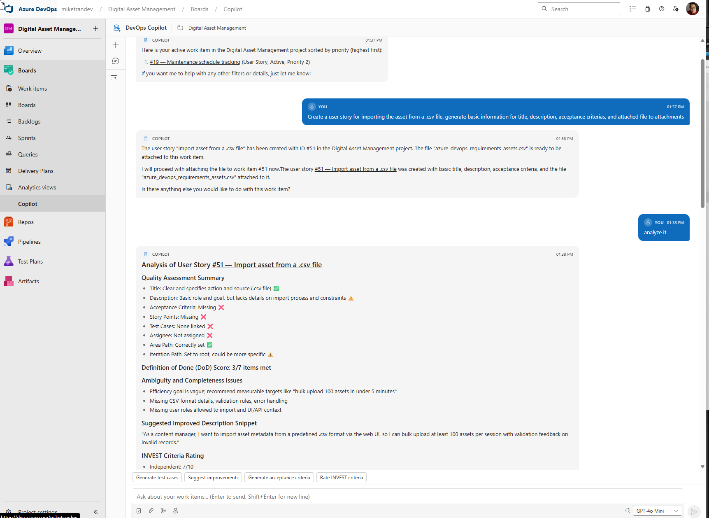
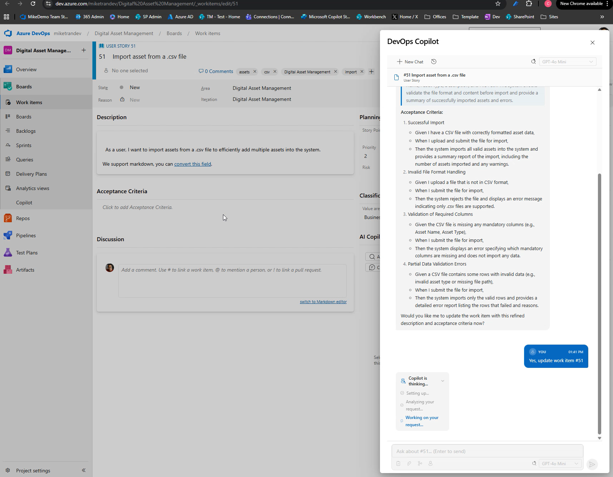

# DevOps Copilot — AI-Powered Azure DevOps Extension

An open-source Azure DevOps extension that brings AI-powered copilot capabilities to Azure Boards. Search, analyze, create, and manage work items using natural language powered by **Microsoft Agent Framework** and **Azure OpenAI**.

<video src="docs/assets/Azure%20Devops%20Copilot%20Extension%20-%20Intro.mp4" controls="controls" style="max-width: 100%;"></video>

| AI Chat Hub                             | Work Item AI Panel                               |
| --------------------------------------- | ------------------------------------------------ |
|  |  |

## Features

- **AI Chat Hub** — Dedicated copilot page under Azure Boards for natural language interaction with your backlog
- **Work Item AI Panel** — Contextual AI assistant on every work item form (analyze requirements, suggest improvements)
- **Smart Actions** — Right-click context menu and toolbar actions: "Analyze with AI", "Generate Test Cases", "Suggest Child Items"
- **Multi-Agent Architecture** — Specialist agents (Search, Writer, Analyst, Pipeline, Wiki) coordinated by an orchestrator for complex tasks
- **Dual AI Provider** — Switch between **Azure OpenAI** (default) and **GitHub Models** via a single config setting — no code changes needed
- **Standalone Web App** — Run without an Azure DevOps extension install: open `standalone/standalone.html`, paste your GitHub PAT, and start chatting
- **Secure by Design** — Token forwarding, Key Vault secrets, Managed Identity, no credentials stored client-side

## Architecture

```
┌─────────────────────────────────────────────┐
│  Azure DevOps Extension (TypeScript/React)  │
│   Hub │ Work Item Panel │ Context Menus     │
└──────────────────┬──────────────────────────┘
                   │ HTTPS (OAuth token forwarded)
                   ▼
┌─────────────────────────────────────────────┐
│  Azure Functions (.NET 9)                   │
│  Microsoft Agent Framework                  │
│                                             │
│  ┌────────────┐                             │
│  │Orchestrator│──┬──► SearchAgent           │
│  │   Agent    │  ├──► WriterAgent           │
│  └────────────┘  └──► AnalystAgent          │
│        │                    │               │
│        ▼                    ▼               │
│  Azure OpenAI         Azure DevOps          │
│  (GPT-4o)             REST API              │
└─────────────────────────────────────────────┘
```

## Project Structure

```
├── extension/          # Azure DevOps extension (TypeScript, React, Webpack)
├── backend/            # Azure Functions + Microsoft Agent Framework (.NET 9)
├── infra/              # Bicep IaC templates (Storage, Key Vault, OpenAI, Function App)
├── docs/               # Documentation
├── .github/workflows/  # CI/CD pipelines (ci, deploy-backend, deploy-extension)
└── .devcontainer/      # Dev Container / GitHub Codespaces support
```

---

## Run Locally

There are two ways to run this project locally:

| Mode                             | AI Provider               | Frontend               | Requires                     |
| -------------------------------- | ------------------------- | ---------------------- | ---------------------------- |
| **Azure OpenAI + ADO Extension** | Azure OpenAI              | Azure DevOps Extension | Azure subscription + ADO org |
| **GitHub Models + Standalone**   | GitHub Models (free tier) | Standalone web page    | GitHub account only          |

Follow these steps to get the full stack running on your machine for development and testing.

### Prerequisites

| Tool                       | Version | Install                                                                                               |
| -------------------------- | ------- | ----------------------------------------------------------------------------------------------------- |
| .NET SDK                   | 9.0+    | [Download](https://dotnet.microsoft.com/download/dotnet/9.0)                                          |
| Node.js                    | 20+     | [Download](https://nodejs.org/)                                                                       |
| Azure Functions Core Tools | v4      | [Install](https://learn.microsoft.com/azure/azure-functions/functions-run-local)                      |
| tfx-cli                    | latest  | `npm install -g tfx-cli` (only needed for ADO extension mode)                                         |
| Azure CLI                  | latest  | [Install](https://learn.microsoft.com/cli/azure/install-azure-cli) (only needed for Azure deployment) |

Depending on your chosen mode, you also need:

- **Azure OpenAI + Extension mode:** An [Azure OpenAI resource](https://portal.azure.com/#create/Microsoft.CognitiveServicesOpenAI) with a GPT-4o deployment + an [Azure DevOps organization](https://dev.azure.com)
- **GitHub Models + Standalone mode:** A [GitHub Personal Access Token](https://github.com/settings/tokens) with the **`models:read`** scope (no Azure account required)

> **Tip:** Use the included `.devcontainer/` for GitHub Codespaces or VS Code Dev Containers — all tools are pre-installed.

### Step 1 — Clone the Repository

```bash
git clone https://github.com/YOUR-ORG/devops-copilot.git
cd devops-copilot
```

### Step 2 — Configure & Start the Backend

```bash
cd backend

# Create local settings from the template
cp local.settings.example.json local.settings.json
```

#### Option A — Azure OpenAI (full ADO extension mode)

Edit **`local.settings.json`** with your Azure OpenAI values:

```json
{
    "IsEncrypted": false,
    "Values": {
        "AzureWebJobsStorage": "",
        "FUNCTIONS_WORKER_RUNTIME": "dotnet-isolated",
        "AIProvider": "AzureOpenAI",
        "AppMode": "AzureDevOps",
        "AzureOpenAI__Endpoint": "https://YOUR-RESOURCE.openai.azure.com/",
        "AzureOpenAI__DefaultDeployment": "gpt-4o",
        "AzureOpenAI__ApiKey": "YOUR-AZURE-OPENAI-API-KEY",
        "AzureDevOps__DefaultOrganizationUrl": "https://dev.azure.com/YOUR-ORG",
        "Extension__SharedSecret": "",
        "Memory__Provider": "localFile",
        "Memory__LocalFilePath": "./sessions"
    },
    "Host": {
        "CORS": "https://localhost:3000,https://dev.azure.com,https://*.visualstudio.com",
        "CORSCredentials": true
    }
}
```

| Setting                               | Description                                                                                                     |
| ------------------------------------- | --------------------------------------------------------------------------------------------------------------- |
| `AIProvider`                          | `"AzureOpenAI"` (default) or `"GitHubModels"`                                                                   |
| `AppMode`                             | `"AzureDevOps"` (default), `"Standalone"`, or `"Both"`                                                          |
| `AzureOpenAI__Endpoint`               | Your Azure OpenAI resource endpoint (Azure Portal → your resource → Keys & Endpoint)                            |
| `AzureOpenAI__DefaultDeployment`      | The model deployment name (e.g. `gpt-4o`)                                                                       |
| `AzureOpenAI__ApiKey`                 | API key from your Azure OpenAI resource. Leave blank to use `az login` credentials via `DefaultAzureCredential` |
| `AzureDevOps__DefaultOrganizationUrl` | Your Azure DevOps org URL, e.g. `https://dev.azure.com/myorg`                                                   |
| `Extension__SharedSecret`             | Leave empty for local dev (disables token validation). Set in production for security                           |

#### Option B — GitHub Models + Standalone web app (no Azure required)

This mode uses [GitHub Models](https://github.com/marketplace/models) as the AI backend and a standalone web page as the frontend — no Azure subscription or Azure DevOps organization needed.

**1. Create a GitHub PAT**

Go to [GitHub → Settings → Personal Access Tokens (fine-grained)](https://github.com/settings/tokens) and create a token with the **`models:read`** permission (under "GitHub Models").

**2. Configure `local.settings.json`**

Replace the contents with this minimal configuration:

```json
{
    "IsEncrypted": false,
    "Values": {
        "AzureWebJobsStorage": "",
        "FUNCTIONS_WORKER_RUNTIME": "dotnet-isolated",
        "AIProvider": "GitHubModels",
        "AppMode": "Standalone",
        "GitHubModels__Endpoint": "https://models.github.ai/inference/",
        "GitHubModels__ApiKey": "",
        "GitHubModels__DefaultModel": "openai/gpt-4o-mini",
        "Memory__Provider": "localFile",
        "Memory__LocalFilePath": "./sessions",
        "Cors__AllowedOrigins": "https://localhost:3000,http://localhost:3000"
    },
    "Host": {
        "CORS": "https://localhost:3000,http://localhost:3000",
        "CORSCredentials": true
    }
}
```

> **`GitHubModels__ApiKey`** can be left empty — users enter their own GitHub PAT in the standalone UI's Settings panel (gear icon). Set it here to provide a shared server-side key instead.

| Setting                      | Description                                                                                    |
| ---------------------------- | ---------------------------------------------------------------------------------------------- |
| `AIProvider`                 | Set to `"GitHubModels"`                                                                        |
| `AppMode`                    | `"Standalone"` — skips Azure DevOps extension token validation entirely                        |
| `GitHubModels__Endpoint`     | GitHub Models inference endpoint (don't change this)                                           |
| `GitHubModels__ApiKey`       | Optional server-side GitHub PAT. Leave blank to require users to enter their own PAT in the UI |
| `GitHubModels__DefaultModel` | Default model name, e.g. `openai/gpt-4o-mini` or `openai/gpt-4o`                               |

> **Rate limit warning:** GitHub Models free tier allows ~10 requests per minute / 50 per day for GPT-4o. Each user message triggers 3–6 internal LLM calls through multi-agent orchestration, so expect ~8–15 usable interactions per day on the free tier. Use `openai/gpt-4o-mini` for higher limits.

Build and start the backend:

```bash
dotnet restore
dotnet build
func start
```

Verify the backend is running:

```bash
curl http://localhost:7071/api/health
# Should return: {"status":"healthy","timestamp":"..."}
```

### Step 3 — Start the Frontend

#### Option A — Standalone web app (GitHub Models mode)

```bash
cd extension
npm install
npm run dev
```

Open **`https://localhost:3000/standalone/standalone.html`** in your browser.

1. Accept the self-signed certificate warning (click **Advanced → Proceed**)
2. Click the **gear icon** (⚙) in the top-right to open Settings
3. Enter your GitHub PAT and click **Save**
4. Start chatting — no Azure DevOps account needed

> If you set `GitHubModels__ApiKey` in `local.settings.json`, you can skip entering a PAT in the UI.

#### Option B — Azure DevOps Extension (Sideload)

### Step 4 — Build & Sideload the Extension (ADO mode)

> **Important:** Azure DevOps **Services** (cloud at dev.azure.com) does **not** support uploading extensions from a local file. You must publish through the Visual Studio Marketplace, even for private dev extensions. ("Browse local extensions" only exists on self-hosted Azure DevOps Server.)

**3a — Create a Marketplace publisher account (one-time)**

1. Go to [marketplace.visualstudio.com/manage](https://marketplace.visualstudio.com/manage) and sign in with your Microsoft account
2. Click **Create publisher**, fill in a publisher ID (e.g. `mycompany-devops`) and display name, then save

**3b — Set your publisher ID in the extension manifest (one-time)**

Edit `extension/azure-devops-extension.json` and replace `YOUR-PUBLISHER-ID` with the ID you just created:

```json
{
  "publisher": "mycompany-devops",
  ...
}
```

**3c — Generate a Marketplace PAT (one-time)**

1. Go to your Azure DevOps organization → top-right avatar → **Personal Access Tokens**
2. Click **New Token**, give it a name (e.g. `marketplace-publish`)
3. Under **Scopes**, select **Custom defined** → enable **Marketplace → Publish** (under Marketplace → Manage)
4. Copy the token — you'll use it as `YOUR-MARKETPLACE-PAT` below

**3d — Build and package**

Open a new terminal:

```bash
cd extension
npm install
npm run package:dev
```

This creates `extension/dist/YOUR-PUBLISHER-ID.devops-copilot-dev-1.0.0.vsix`.

**3e — Publish as a private extension and install it**

1. Upload the `.vsix` to the Marketplace as **private**:

    ```powershell
    # PowerShell (Windows) — use (Get-Item ...) to expand the glob
    npx tfx-cli extension publish `
      --vsix (Get-Item dist/*.vsix).FullName `
      --token YOUR-MARKETPLACE-PAT
    ```

    ```bash
    # bash / macOS / Linux
    npx tfx-cli extension publish \
      --vsix dist/*.vsix \
      --token YOUR-MARKETPLACE-PAT
    ```

    > **Note (PowerShell):** PowerShell does not expand `*.vsix` glob patterns. Use `(Get-Item dist/*.vsix).FullName` to resolve the actual filename, or pass it explicitly, e.g. `--vsix dist/MikeTtest.devops-copilot-dev-1.0.0.vsix`.

2. Share it with your Azure DevOps organization:

    ```powershell
    npx tfx-cli extension share `
      --publisher YOUR-PUBLISHER-ID `
      --extension-id devops-copilot-dev `
      --share-with YOUR-ORG-NAME `
      --token YOUR-MARKETPLACE-PAT
    ```

3. Install in Azure DevOps:
    - Go to **Organization Settings** → **Extensions** → **Shared** tab
    - Find **DevOps Copilot (Dev)** and click **Install**

### Step 5 — Use the App

**Standalone mode (GitHub Models):**

- Open `https://localhost:3000/standalone/standalone.html`
- Enter your GitHub PAT in Settings if prompted
- Ask anything — e.g. _"Help me write acceptance criteria for a login feature"_
- With an optional ADO PAT in Settings, DevOps tools (search work items, create stories, etc.) are also available

**ADO extension mode:**

1. Navigate to your Azure DevOps project → **Boards** → **Copilot** (new hub page)
2. Try natural language queries:
    - _"Show me all active bugs"_
    - _"Create a user story for adding login functionality"_
    - _"Analyze work item #123"_
3. Open any work item — you'll see a new **AI Copilot** panel in the form
4. Right-click any work item — you'll see new context menu actions

### Step 6 — Development Workflow

For active development `npm run dev` starts a webpack-dev-server over **HTTPS on port 3000** — the same URL the dev extension loads its iframes from.

```powershell
# Terminal 1: Backend API
cd backend
func start

# Terminal 2: Extension HTTPS dev server (rebuilds on every file save)
cd extension
npm run dev
```

**One-time: accept the self-signed certificate**

The dev server uses an auto-generated self-signed certificate. Azure DevOps won't load iframes from an untrusted origin, so you need to trust the cert once in your browser:

1. Open **`https://localhost:3000`** in the same browser you use for Azure DevOps
2. You'll see a browser security warning — click **Advanced → Proceed to localhost (unsafe)** (Chrome) or **Accept the Risk and Continue** (Firefox)
3. You should see a directory listing or blank page — that's fine, it just confirms the cert is trusted
4. Go back to Azure DevOps and refresh — the extension iframes will now load

After the extension rebuilds (on any file save), refresh the Azure DevOps page to pick up changes.

**Run backend tests:**

```powershell
cd backend/Tests
dotnet test
```

### Troubleshooting (Local)

**GitHub Models / Standalone mode:**

| Issue                                               | Solution                                                                                                         |
| --------------------------------------------------- | ---------------------------------------------------------------------------------------------------------------- |
| Chat returns errors after a few messages            | GitHub Models free tier rate limit hit. Wait a minute or switch to `openai/gpt-4o-mini`                          |
| `No GitHub Models API key configured` backend error | Either set `GitHubModels__ApiKey` in `local.settings.json` or enter your PAT in the standalone UI Settings panel |
| Standalone page won't load                          | Accept the self-signed cert at `https://localhost:3000` first (click Advanced → Proceed)                         |
| DevOps tools not working in standalone mode         | Enter an ADO Organization URL + ADO PAT in the Settings panel (both are optional but enable work item access)    |
| `GitHubModels:ApiKey required` startup error        | Set `AppMode` to `"Standalone"` or `"Both"`, or provide `GitHubModels__ApiKey`                                   |

**Azure OpenAI / ADO Extension mode:**

| Issue                                           | Solution                                                                                                                                                                            |
| ----------------------------------------------- | ----------------------------------------------------------------------------------------------------------------------------------------------------------------------------------- |
| `CORS error` / preflight blocked                | Add a `"Host": { "CORS": "https://localhost:3000,...", "CORSCredentials": true }` section to `local.settings.json` — `host.json` CORS is only applied in Azure, not by `func start` |
| `401 Unauthorized` from backend                 | Set `Extension__SharedSecret` to empty string in `local.settings.json` to disable token validation for local dev                                                                    |
| Extension doesn't appear in Azure DevOps        | The extension must be published to Marketplace as private, shared with your org, and installed. Check **Organization Settings → Extensions → Shared**                               |
| Work item form group / context menu not loading | You must accept the self-signed cert at `https://localhost:3000` first (see Step 5 above). Without this, ADO silently refuses to load the iframes                                   |
| Rule Engine errors on work item form            | Usually harmless ADO platform noise when AreaPath/IterationPath trees aren't fully loaded. Unrelated to the extension — refresh the page                                            |
| `AzureOpenAI:Endpoint not configured`           | Check all `AzureOpenAI__*` values in `local.settings.json`                                                                                                                          |
| `npm install` fails with peer dep errors        | Run `npm install --legacy-peer-deps` (or use the included `.npmrc` which sets this automatically)                                                                                   |
| Backend port conflict                           | Azure Functions Core Tools defaults to port 7071. If in use, run `func start --port 7072` and update `DEFAULT_BACKEND_URL` in `extension/src/services/backendApi.ts`                |

---

## Publish to Azure

Follow these steps to deploy the backend to Azure and publish the extension to the Visual Studio Marketplace.

### Prerequisites

- An Azure subscription with permission to create resources
- Azure CLI installed and authenticated: `az login`
- A [Visual Studio Marketplace publisher account](https://marketplace.visualstudio.com/manage) (free to create)

### Step 1 — Deploy Azure Infrastructure

Create all required Azure resources (Function App, Azure OpenAI, Key Vault, Storage, App Insights) using the provided Bicep templates:

```bash
# Create resource group
az group create --name devops-copilot-rg --location eastus2

# Deploy infrastructure
az deployment group create \
  --resource-group devops-copilot-rg \
  --template-file infra/main.bicep \
  --parameters infra/parameters/dev.bicepparam
```

> **What gets created:** Storage Account, Log Analytics + Application Insights, Key Vault, Azure OpenAI (with GPT-4o deployment), Function App on Premium EP1 plan with Managed Identity.

After deployment, note the **Function App name** and **URL** from the output. Then store the OpenAI API key in Key Vault:

```bash
# Get the deployed resource names (adjust if you customized baseName)
FUNC_APP_NAME="devopscopilot-func"   # from Bicep output
KV_NAME="devopscopilot-kv"           # from Bicep output

# Store secrets in Key Vault
az keyvault secret set --vault-name $KV_NAME --name openai-api-key --value "YOUR-OPENAI-API-KEY"
```

> **Cost Tip:** For development/testing, edit `infra/parameters/dev.bicepparam` and change `functionPlanSku` from `'EP1'` to `'Y1'` (Consumption plan) to reduce costs. Be aware of cold starts on Consumption plan.

### Step 2 — Deploy the Backend Function App

```bash
cd backend

# Build for release
dotnet publish -c Release -o ./publish

# Deploy to Azure
func azure functionapp publish $FUNC_APP_NAME --dotnet-isolated
```

Verify the deployment:

```bash
curl https://$FUNC_APP_NAME.azurewebsites.net/api/health
# Should return: {"status":"healthy","timestamp":"..."}
```

**Configure application settings** (if not sourced from Key Vault):

```bash
az functionapp config appsettings set \
  --name $FUNC_APP_NAME \
  --resource-group devops-copilot-rg \
  --settings \
    "AzureOpenAI__Endpoint=https://YOUR-RESOURCE.openai.azure.com/" \
    "AzureOpenAI__DeploymentName=gpt-4o" \
    "AzureDevOps__DefaultOrganizationUrl=https://dev.azure.com/YOUR-ORG" \
    "Extension__SharedSecret=GENERATE-A-STRONG-SECRET-HERE"
```

> The Bicep templates configure the Function App to read the OpenAI API key from Key Vault via Managed Identity. You only need to set `AzureOpenAI__ApiKey` manually if not using Key Vault.

### Step 3 — Update the Extension Backend URL

Before publishing the extension, point it to your Azure-hosted backend.

Edit **`extension/src/services/backendApi.ts`** and change the default URL:

```typescript
const DEFAULT_BACKEND_URL = "https://devopscopilot-func.azurewebsites.net/api";
```

Replace `devopscopilot-func` with your actual Function App name.

### Step 4 — Create a Marketplace Publisher

1. Go to [Visual Studio Marketplace Publishing Portal](https://marketplace.visualstudio.com/manage)
2. Sign in with your Microsoft account
3. Click **Create publisher** and choose a publisher ID (e.g., `your-company-name`)
4. Edit **`extension/azure-devops-extension.json`** and update the `publisher` field:

```json
{
  "publisher": "your-company-name",
  ...
}
```

### Step 5 — Build & Publish the Extension

```bash
cd extension
npm install
npm run build

# Package the extension
npx tfx-cli extension create \
  --manifest-globs dist/azure-devops-extension.json \
  --output-path ./dist
```

**Option A — Publish publicly to the Marketplace:**

```powershell
# PowerShell
npx tfx-cli extension publish `
  --vsix (Get-Item dist/*.vsix).FullName `
  --token YOUR-MARKETPLACE-PAT
```

```bash
# bash / macOS / Linux
npx tfx-cli extension publish \
  --vsix dist/*.vsix \
  --token YOUR-MARKETPLACE-PAT
```

> Generate a PAT at https://dev.azure.com with **Marketplace → Manage** scope.

**Option B — Share privately with specific organizations (recommended for testing):**

```powershell
# PowerShell
npx tfx-cli extension publish `
  --vsix (Get-Item dist/*.vsix).FullName `
  --token YOUR-MARKETPLACE-PAT

npx tfx-cli extension share `
  --publisher your-company-name `
  --extension-id devops-copilot `
  --share-with your-org-name `
  --token YOUR-MARKETPLACE-PAT
```

```bash
# bash / macOS / Linux
npx tfx-cli extension publish \
  --vsix dist/*.vsix \
  --token YOUR-MARKETPLACE-PAT

npx tfx-cli extension share \
  --publisher your-company-name \
  --extension-id devops-copilot \
  --share-with your-org-name \
  --token YOUR-MARKETPLACE-PAT
```

Then install in the target organization: **Organization Settings** → **Extensions** → **Shared** → find and install.

### Step 6 — Configure CORS for Production

Ensure the Function App allows requests from Azure DevOps. The Bicep template configures this automatically, but you can verify:

```bash
az functionapp cors show --name $FUNC_APP_NAME --resource-group devops-copilot-rg
```

Expected allowed origins: `https://dev.azure.com`, `https://*.visualstudio.com`

If missing:

```bash
az functionapp cors add --name $FUNC_APP_NAME --resource-group devops-copilot-rg \
  --allowed-origins "https://dev.azure.com"
```

### Step 7 — Post-Deployment Checklist

- [ ] Azure OpenAI endpoint is accessible and GPT-4o deployment is active
- [ ] Key Vault has the `openai-api-key` secret
- [ ] Function App has system-assigned Managed Identity enabled
- [ ] Function App has **Key Vault Secrets User** role on the Key Vault
- [ ] Function App CORS allows `https://dev.azure.com`
- [ ] `Extension__SharedSecret` is set in Function App app settings (and matches the extension if you implement custom token signing)
- [ ] Extension is installed in the target Azure DevOps organization
- [ ] Health check passes: `curl https://<func-app>.azurewebsites.net/api/health`
- [ ] Open the **Copilot** hub in Azure Boards and test a query

### Automated CI/CD (GitHub Actions)

The repository includes three GitHub Actions workflows for automated deployment:

| Workflow             | File                                     | Trigger             | What it does                                             |
| -------------------- | ---------------------------------------- | ------------------- | -------------------------------------------------------- |
| **CI**               | `.github/workflows/ci.yml`               | PR & push to `main` | Builds backend + extension, runs tests                   |
| **Deploy Backend**   | `.github/workflows/deploy-backend.yml`   | Push to `main`      | Deploys Bicep infra + publishes Function App             |
| **Deploy Extension** | `.github/workflows/deploy-extension.yml` | Push to `main`      | Builds, packages, and publishes extension to Marketplace |

**Required GitHub secrets/variables:**

| Secret                  | Description                                               |
| ----------------------- | --------------------------------------------------------- |
| `AZURE_CLIENT_ID`       | Service principal / App Registration client ID (for OIDC) |
| `AZURE_TENANT_ID`       | Azure AD tenant ID                                        |
| `AZURE_SUBSCRIPTION_ID` | Azure subscription ID                                     |
| `MARKETPLACE_PAT`       | VS Marketplace Personal Access Token                      |

| Variable         | Description                      |
| ---------------- | -------------------------------- |
| `RESOURCE_GROUP` | Target Azure resource group name |
| `ENVIRONMENT`    | `dev` or `prod`                  |

See [docs/deployment.md](docs/deployment.md) for OIDC federation setup details.

### Estimated Monthly Costs

| Resource             | SKU               | Estimated Cost                                     |
| -------------------- | ----------------- | -------------------------------------------------- |
| Azure Functions      | Premium EP1       | ~$130/mo                                           |
| Azure OpenAI         | S0 + GPT-4o usage | Pay-per-token (~$0.005/1K input, $0.015/1K output) |
| Key Vault            | Standard          | ~$0.03/10K operations                              |
| Application Insights | Pay-as-you-go     | ~$2.30/GB ingested                                 |
| Storage Account      | Standard LRS      | ~$0.02/GB                                          |

> Use the Consumption plan (`Y1`) instead of Premium (`EP1`) for dev/test to reduce to ~$0/mo + per-execution costs.

---

## Documentation

- [Getting Started](docs/getting-started.md) — detailed local development setup
- [Architecture](docs/architecture.md) — design decisions, agent system, data flow
- [Deployment](docs/deployment.md) — full Azure deployment guide
- [Extending](docs/extending.md) — adding new agents, tools, and extension points

## Contributing

We welcome contributions! See [CONTRIBUTING.md](CONTRIBUTING.md) for guidelines.

## License

[MIT](LICENSE)
